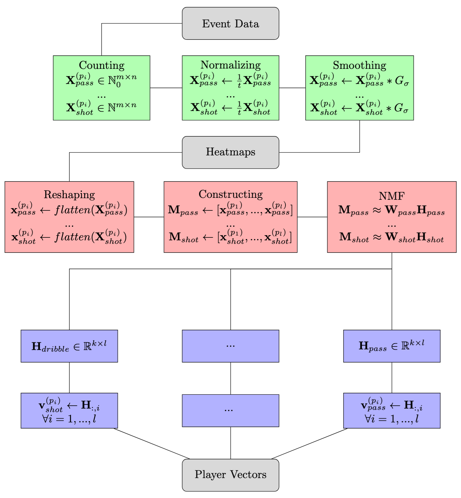

Since this summer is the FIFA World Cup 2026, my first blog post is about football. The goal of this post is to discuss the Player Vectors framework, provide detailed algorithms that make it straightforward to implement - in any programming language of choice.
Further, we reduce the dimension of player vectors by using the non-linear dimensionality reduction algorithm UMAP.

Motivation
======
Player Vectors were introduced by Decroos and Davis [[1]](#decroos2020player). The motivation behind Player Vectors is to provide a flexible framework for representing a player's playing style in a compact vector form - derived directly from raw event data.
Such compact representations can be used in player scouting (e.g. by searching for players with similar playing styles). Furthermore, they are designed to be interpretable by both human experts and machine learning systems. E.g. each component of a player vector represents the "strength" of the playing style in a "lookup table" of heatmaps; fixed-size vectors can be easly feed into machine learning systems - neural networks, decision trees, ... 

To represent playing style in a fixed-size vector, we first need to define what we mean by playing style. 
Here, we follow the definition of Decroos and Davis [[1]](#decroos2020player):


* **"A player’s playing style can be characterized by his preferred area's on the field to occupy and which actions he tends to perform in each of these locations."**

According to Decroos and Davis, successfully characterizing playing style from event data relies on two assumptions. 
First, most players differ in their playing style, and second, a player’s playing style remains constant over short periods of time.

Preliminaries
======

### Player Vectors

---

Feel free to first read the original paper [[1]](#decroos2020player) ["Player Vectors: Characterizing Soccer Players’
Playing Style from Match Event Streams"](https://tomdecroos.github.io/reports/ecml19_tomd.pdf) before continuing with this blog post.

### Frobenius norm

---

Let $\textbf{X} \in \mathbb{R}^{m \times n}$ be an arbitrary matrix, the Frobenius norm is defined as:

$$
\begin{equation}
    ||\textbf{X}||_{F} = \sqrt{\sum_{i = 1}^{m} \sum_{j=1}^{n} X_{i, j}^{2}}
\end{equation}
$$

### Non-Negative Matrix Factorization

---

Let $\mathbf{X}$ be an arbitrary non-negative matrix,

$$
\mathbf{X} \in \mathbb{R}_{\geq 0}^{m \times n},
$$

and let $k \in \mathbb{N}$ with

$$
k < \min\{n, m\}
$$

be the number of components.

Non-Negative Matrix Factorization (NMF or NNMF) [[2]](#lee2001) finds two matrices

$$
\mathbf{W} \in \mathbb{R}_{\geq 0}^{m \times k}
\quad \text{and} \quad
\mathbf{H} \in \mathbb{R}_{\geq 0}^{k \times n}
$$

that minimize the Frobenius norm

$$
\begin{equation}
\|\mathbf{X} - \mathbf{W}\mathbf{H}\|_{F}.
\end{equation}
$$

A useful property which will help us in later is that, each column of $\textbf{X}$ is a linear combination of the columns of $\textbf{W}$ weighted with the corresponding columns in $\textbf{H}$ [[2]](#lee2001). 
Formally, let $\mathbf{x_{i}}$ be the $i$-th column of $\textbf{X}$ and $\mathbf{h_{i}}$ be the $i$-th column of $\textbf{H}$, $\mathbf{x_{i}}$ can be computed as follows:

$$
  \begin{equation}
    \mathbf{x_{i}} \approx \textbf{W}\mathbf{h_{i}}
  \end{equation}
$$

Therefore, $\textbf{X}$ can be approximated by the matrix multiplication of $\textbf{W}$ and $\textbf{H}$:

$$
\begin{equation}
    \textbf{X} \approx \textbf{W}\textbf{H}
\end{equation}
$$

It is important to notice, that NMF does not have a unique solution [[3]](#nmf_unique).

Algorithm Overview
------
When building player vectors we first need to select relevant event types (e.g. passes, shots, dribbles, ...) and respective number of components (e.g. 4, 4, 5, ...) for characterizing playing style [[1]](#decroos2020player).
The rest of the algorithm can be broken down to three major parts: *Constructing*, *Compressing*, and *Assembling* [[1]](#decroos2020player).

Flowchart 1 illustrates the three main steps when computing player vectors: Construction
(green), Compressing (red) and Assembling (blue).

<figure id="flowchart_pvs" align="center">
  
  <figcaption><em>Flowchart 1: Process of computing player vectors.</em></figcaption>
</figure>

### Construction

---

Let $e \in \{\text{"shot"}, \text{"pass"}, "dribble", \ldots \}$ denote a football event type. Given an event dataset

$$
\mathcal{D}_e = \{(p_i, x_i, y_i)\}_{i=1}^{N},
$$

containing $N$ events of type $e$, each 3-tuple consists of a player identification $p_i \in \mathbb{N}$ and the corresponding event location $(x_i, y_i) \in \mathbb{R}^2$. E.g. $p_i$ identifies the player who performed event $e$ at position $(x_i, y_i)$. $D_e$ may be all events of type $e$ in an entire season.

In the construction phase we compute player heatmaps (for an event of choice). Each player will have a unique heatmap summaraizing where he performs that event. The heatmaps can be computed as follows: 

* Select an event of interest (e.g. $e = $ "pass")

* Overlay a $m \times n$ grid over the soccer pitch

* Initalize a zero matrix $\textbf{X}^{(p)} \in \mathbb{N}_{0}$ for each player

* For each player, count the number of events on the pitch w.r.t. $(x, y)$ coordinates

* For each player, normalize the counts by dividing by the total number of playing time

* For each player, apply a Gaussian smoothing filter to the normalized counts

<figure id="algorithm-1" align="center">
  
  <figcaption><em>Algorithm 1: Construct heatmaps.</em></figcaption>
</figure>

<a href="#algorithm-1">Algorithm 1</a> shows the process of computing player heatmaps of an event $e$. Each heatmap summarizes the spatial location where player $p$ performs event $e$. 
$G_{\sigma}$ denotes the 2-dimensional Gaussian filter with zero mean, which is a standard image processing algorithm. 
The operation $*$ denotes a 2-dimensional convolution which is also commonly used in image processing.

The Gaussian filter is defined by:

$$ 
    \begin{equation}
    G_{\sigma}(x, y) = \frac{1}{\sqrt{2 \pi \sigma^2}}\exp(-\frac{x^2 + y^2}{2\sigma^2})
    \end{equation}
$$

A discrete 2-dimensional gaussian convolution is given by:

$$ 
    \begin{equation}
    (\textbf{X} * G_{\sigma})_{i, j} = \sum_{m = -\infty}^{\infty} \sum_{n=-\infty}^{\infty} X_{m, n} G_{\sigma}(i - m, j - n)
    \end{equation}
$$

If we are interested in both the start and end location of an event, we can work with two datasets $\mathcal{D}^{start}_{e}, \mathcal{D}^{end}_{e}$ containing the start and end positions. We then can compute the heatmaps in parallel using <a href="#algorithm-1">Algorithm 1</a>.

### Compressing

---

Assume we already computed player heatmaps $\{\tilde{X}^{(p_{1})}, ..., \tilde{X}^{(p_{l})}\}$ where $l$ is the number of unique players in the dataset. In the next step, we compress the heatmaps using NMF. 
First, flatten each player heatmap $\tilde{\textbf{X}}^{(p_{i})} \in \mathbb{R}^{m \times n}$ into a column vector $\textbf{x}^{(p_{i})} \in \mathbb{R}^{mn}$. We then construct a matrix $\textbf{M} \in \mathbb{R}^{mn \times l}$ by stacking all flattend heatmaps:

$$
M = [\textbf{x}^{(p_{1})}, ..., \textbf{x}^{(p_{l})}] \in \mathbb{R}^{mn \times l},
$$

please note that the columns of matrix $\mathbf{M}$ are the reshaped heatmaps of each player.

Matrix $\mathbf{M}$ is compressed using NMF resulting in the factorization

$$
M = WH,
$$

where $\textbf{W} \in \mathbb{R}^{mn \times k}$ and $\textbf{H} \in \mathbb{R}^{k \times l}$. 

As described in Preliminaries $k \in \mathbb{N}$ is a user defined parameter that controls the number of principal components, meaning $k$ directly controls the number of columns and rows of $\mathbf{W}$ and $\mathbf{H}$. 
The columns of $\mathbf{W}$ are the principal components which describe the spatial constructed heatmaps.
The rows of $\mathbf{H}$ are the compressed versions of the heatmaps.

We can interpret the $i$-th row $\mathbf{h_{i}}$ of $\mathbf{H}$ as the weights needed when multiplied with $\mathbf{W}$ to reconstruct the heatmap of $i$-th player:

$$
  \textbf{x}^{(p_{i})} \approx \textbf{W}\mathbf{h_{i}}
$$


<figure id="algorithm-2" align="center">
  
  <figcaption><em>Algorithm 2: Compress heatmaps.</em></figcaption>
</figure>

Algorithm 2 shows the detailed procedure of compressing heatmaps using NMF. If we are interested in both the start and end locations of an event $e$, then for each player $p_i$ we first construct two heatmaps,

$$
\mathbf{X}^{(p_i)}_{\text{start}}, \mathbf{X}^{(p_i)}_{\text{end}} \in \mathbb{R}^{m \times n},
$$

as described in the Construction phase. We then flatten and concatenate as follows:

$$
  \textbf{x}^{(p^{(i)})} = \text{concat}(\text{flatten}(\mathbf{X}^{(p^{(i)})}_{start}), \text{flatten}(\mathbf{X}^{(p^{(i)})}_{end})) \in \mathbb{R}^{2mn}
$$

Therefore $\mathbf{M} \in \mathbb{R}^{2mn \times l}, \mathbf{W} \in \mathbb{R}^{2mn \times k}, \text{} \mathbf{H} \in \mathbb{R}^{k \times l}$. 

### Assemble

---

If we are building player vectors for just one event type $e$ with $k$ components, we would not need to assemble, because our player vector of the i-th player would just be the i-th column of matrix $\mathbf{H}$

$$
  \mathbf{v}^{p_i}_{e} = \mathbf{h_{i}} = \mathbf{H_{:,i}}
$$

However, if we are using more than one event, we simply concatentate all matching player columns of matrices $\mathbf{H}_{e_1}, \mathbf{H}_{e_2}, ...$ together.

E.g., let $\textbf{H}_{\text{shot}} \in \mathbb{R}^{4 \times l}, \textbf{H}_{\text{cross}} \in \mathbb{R}^{8 \times l}$ be compressed heatmaps for the events "shot" and "cross" with components 4 and 8. The $4 + 8 = 12$ dimensional player vector of the i-th player would be 

$$
v^{(p_{i})}_{\text{shot, cross}} = \text{concat} (\textbf{h}^\text{shot}_{i}, \textbf{h}^{cross}_{i}) \in \mathbb{R}_{\ge 0}^{12}
$$

<figure id="algorithm-3" align="center">
  
  <figcaption><em>Algorithm 3: Assemble player vectors.</em></figcaption>
</figure>

Empirical Analysis
------
In this section, we fit Player Vectors to the event data from the 2017/2018 seasonal Wyscout kaggle dataset [[7]](#wyscout), [[8]](#pappalardo2019soccer) and interprete the results.

The source code of my Player Vectors implementation can be found here:

* [https://github.com/raphaelsenn/playervectors](https://github.com/raphaelsenn/playervectors)

The Wyscout kaggle dataset is availbale here:

* [Wyscout 2017/2018 Dataset Kaggle](https://www.kaggle.com/datasets/aleespinosa/soccer-match-event-dataset)

My Player Vector package can be installed using pip:

```bash
pip install playervectors
```
---

To characterize the playing style of football players we followed
Decroos and Davis [[1]](#decroos2020player) by choosing the events shot, cross, dribble and pass. We constructed
24-dimensional player vectors for the four selected events shot (4 components), cross (4 components), 
dribble (8 components) and pass (8 components) on the event data.
The shot, cross, and dribble components only describe event start locations, whereas the pass components describe both start and end location.
To discretize the soccer pitch, we used a grid of shape $(50 \times 50)$ which was laid over the pitch as described in Algorithm 1. 
The smoothing parameter $\sigma = 4.0$ was found optimal when applying the Gaussian filter.
In our implementation we referred to the Non-Negative Matrix Factorization implementation of scikit-learn library [[4]](#sklearn) and the Gaussian smoothing filter implementation of SciPy [[6]](#scipy).

The code snippets below illustrates, how one can compute player vectors from raw event data. But before we compute player vectors, we first need to preprocess the data:

```python
import ast
import pandas as pd


# Load the Wyscout event data
# Dataset is available here:
# * https://www.kaggle.com/datasets/aleespinosa/soccer-match-event-dataset
df_events = pd.read_csv('./data/actions.csv')       # Event data
df_players = pd.read_csv('./data/players.csv')      # Player person information
df_playerank = pd.read_csv('./data/playerank.csv')  # Player match information

# player_id -> total minutes
pid_to_minutes = (
    df_minutes
    .groupby("playerID")["minutes"]
    .sum()
    .to_dict()
)

# player_id -> full name
pid_to_name = (
    df_players
    .assign(full_name=df_players["firstName"].fillna("") + " " + df_players["lastName"].fillna(""))
    .set_index("wyId")["full_name"]
    .str.strip()
    .to_dict()
)

# player_id -> position, e.g. "GK", "DF", "MF", "FW"
roles = df_players["role"].map(ast.literal_eval)

pid_to_position = dict(
    zip(df_players["wyId"], roles.map(lambda r: r["code2"]))
)

# Normalize playing direction of event data
# NOTE: In this dataset all events are normalized from right-to-left, we normalize from left-to-right
df_events['start_x'] = 105 - df_events['start_x']
df_events['start_y'] = 68 - df_events['start_y']
df_events['end_x'] = 105 - df_events['end_x']
df_events['end_y'] = 68 - df_events['end_y']
```

After preprocessing, we can compute player vectors as follows:

```python
import matplotlib.pyplot as plt

from playervectors import PlayerVectors
from playervectors.visualize import plot_principal_components

pvs = PlayerVectors(
    grid=(50, 50),
    sigma=4.0,
    actions=['shot', 'cross', 'dribble', 'pass'],
    components=[4, 4, 8, 8],
    with_end_coordinates=[False, False, False, True]
)

pvs.fit(
    df_events=df_events,
    minutes_played=minutes_played,
    player_names=playersID_to_name,
    verbose=True
)

# Visualize principal components
plot_principal_components(pvs)
plt.show()
```

<figure id="18-principle-components" align="center">
  
  <figcaption><em>Figure 1: The heatmaps of each component.</em></figcaption>
</figure>

Figure 1 illustrates all 24 components of the player vector,
constructed from the events $\{\text{shot}, \text{cross}, \text{dribble}, \text{pass}\}$ with respective principal components $\{4, 4, 5, 5\}$, 
over an entire season of multiple leagues.

Given a arbitrary player $p_i$, the resulting player vector $v^{(p_i)} \in \mathbb{R}_{\ge 0}^{18}$ is therefore 18-dimensional, containing non-negative values.
Each element $v^{(p_i)}_{j}$ represents the playing style strength in the $j$-th heatmap shown in Figure 1. The values in the vector therefore indicate how strongly the player expresses each global playing style heatmap shown in Figure 1.

```python
from playervectors.visualize import plot_weight_distribution


plot_weight_distribution(pvs)
plt.show()
```

<figure id="principle-components-distribution" align="center">
  
  <figcaption><em>Figure 2: The weight distribution of our 24-component player vectors.</em></figcaption>
</figure>

Our approach yielded more than 3000 distinct player vectors computed from more than 2.4M events.
Figure 2 shows the weight distribution across all player vectors. Since passes are the most common event, their associated weights dominate the distribution. 

```python
from playervectors.visualize import plot_player_weights

selected_players = [
    14712,       # Manuel Neuer,         Positon: Goalkeeper
    3359,        # Lionel Messi,         Positon: Center forward
    14817,       # Robert Lewandowski,   Positon: Center forward
    3322,        # Christiano Ronaldo,   Positon: Center forward
    3306,        # Sergio Ramos,         Positon: Center back
    38021,       # Kevin De Bruyne       Positon: Central midfielder
]

fig, ax = plt.subplots(nrows=3, ncols=2, figsize=(12, 8))
ax = ax.flatten()

for i, player_id in enumerate(selected_players):
    plot_player_weights(pvs, player_id=player_id, ax=ax[i])

plt.show()
```

<figure id="principle-components-distribution" align="center">
  
  <figcaption><em>Figure 3: Player vectors for Manuel Neuer (Goalkeeper), Lionel Messi (Striker), Robert Lewandowski (Striker), Cristiano Ronaldo (Striker), Sergio Ramos (Defender), and Kevin De Bruyne (Midfielder).</em></figcaption>
</figure>

Figure 3 shows the player vectors for Manuel Neuer (Goalkeeper), Lionel Messi (Striker), Robert Lewandowski (Striker), Cristiano Ronaldo (Striker), Sergio Ramos (Defender), and Kevin De Bruyne (Midfielder).

For Manuel Neuer we see high values in the components 9, 17, 18, and 19. Looking these value up in the heatmap table gives patterns that match his role as a goalkeeper quite well. Lionel Messi has high values in component 1, which corresponds to close range shots, and component 23, which also fits his attacking role.

### Embed Player Vectors using UMAP

The objective in this subsection consists of reducing the dimensionality of our $24$-dimensional player vectors using Uniform Manifold Approximation and Projection for Dimension Reduction (UMAP) [[5]](#umap).

```python
import numpy as np
import seaborn as sns
import umap

# Shape [n_players, 24]
X_pvs = np.asarray([val for val in pvs.player_vectors_.values()])

reducer = umap.UMAP(n_neighbors=15, metric="manhattan")

# Shape [n_players, 2]
embedding = reducer.fit_transform(X)

data = pd.DataFrame({"z0": embedding[:, 0], "z1": embedding[:, 1], "Position": Y})

fig, ax = plt.subplots()
sns.scatterplot(data, x="z0", y="z1", hue="Position")
plt.show()
```

<figure id="umap-embedding" align="center">
  
  <figcaption><em>Figure 4: 2-dimensional UMAP embedding of our player vectors with n_neighbors=15 and min_dist = 0.01.</em></figcaption>
</figure>

Figure 4 shows the resulting UMAP-embeddings of our player vectors.
Each player is labeled with their according to thier playing position on the field. 

We observe that, even without relying on clustering, that player vectors are meaningfully embedded (except for some outliers). Goalkeepers and defenders form clearly clusters, which we attribute to their distinctive playing styles. E.g. most goalkeepers
and defenders exhibit low values in the shot and cross components, making them easily
distinguishable.
Midfielders experience the highest variance - their embeddings are spread the widest. This may be because some midfielders operate in
attacking positions, while others play deeper and resemble defenders.

Conclusion
------
We have successfully implemented the Player Vectors framework and computed player vectors on a per-season level using the complete Wyscout dataset of the 2017/2018 season. 
Furthermore, we embedded player vectors using the dimensionality reduction algorithm UMAP and derived distinctive clusters when labeling players with thier actual playing position. 

References
------

<a id="decroos2020player"></a>
[1] T. Decroos and J. Davis, “Player Vectors: Characterizing Soccer Players’ Playing Style from Match Event Streams,” in <i>Machine Learning and Knowledge Discovery in Databases</i>, ECML PKDD 2019, Lecture Notes in Computer Science, vol. 11908, Springer, Cham, 2020, pp. 569–584.

<a id="lee2001"></a>
[2] D. D. Lee and H. S. Seung, “Algorithms for Non-negative Matrix Factorization,” *Advances in Neural Information Processing Systems*, 13, 2001.

<a id="nmf_unique"></a>
[3] Donoho, David L. and Stodden, Victoria, "When does non-negative matrix factorization give a correct decomposition into parts?", *Advances in Neural Information Processing Systems.*

<a id="sklearn"></a>
[4] F. Pedregosa et al., “Scikit-learn: Machine Learning in Python,”
<em>Journal of Machine Learning Research</em>, vol. 12, pp. 2825–2830, 2011.

<a id="umap"></a>
[5] L. McInnes, J. Healy, and J. Melville, “UMAP: Uniform Manifold Approximation
and Projection for Dimension Reduction,” arXiv:1802.03426, 2018.

<a id="scipy"></a>
[6] P. Virtanen et al., “SciPy 1.0: Fundamental Algorithms for Scientific Computing
in Python,” <em>Nature Methods</em>, vol. 17, pp. 261–272, 2020.

<a id="wyscout"></a>
[7] Wyscout soccer match event dataset, Kaggle.

<a id="pappalardo2019soccer"></a>
[8] L. Pappalardo and E. Massucco, “Soccer match event dataset,” figshare, Collection, 2019. doi: 10.6084/m9.figshare.c.4415000.v5.